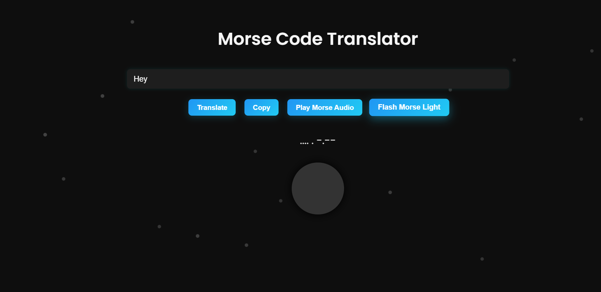

# 🌐 Morse Code Translator

A modern and interactive web app that allows users to convert **text to Morse code** and **Morse code to text**. The app also supports **audio playback** of Morse code and a unique **flashlight visual effect**, simulating how Morse signals are traditionally communicated!


---

## 🚀 Features

- 🔤 **Text to Morse**: Enter plain text and instantly see the corresponding Morse code.
- 🔁 **Morse to Text**: Paste a Morse code sequence and decode it into human-readable text.
- 🔊 **Audio Playback**: Play Morse code as beeps for auditory understanding.
- 💡 **Flashlight Visualizer**: Watch a circular light pulse in sync with Morse signals.
- 🌌 **Space-Themed Background**: Particles float in a starry dark background, simulating outer space.

---

## 🖼️ Screenshots

### ▶️ Main Interface



---

## 🛠️ Tech Stack

- HTML5  
- CSS3 (with animations)  
- JavaScript (Vanilla)

---

## 📁 How to Use

1. Clone the repository:

   ```bash
   git clone https://github.com/shreyamp01/morsecodetranslator.git
   cd morse 
